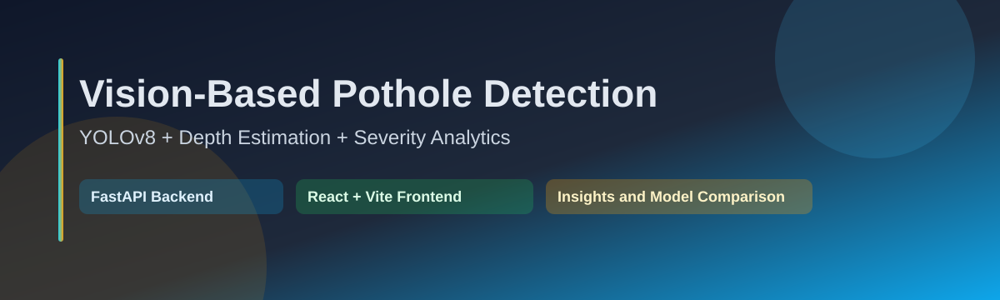
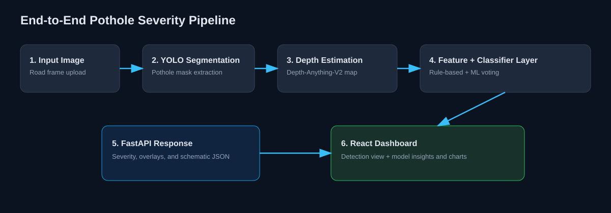
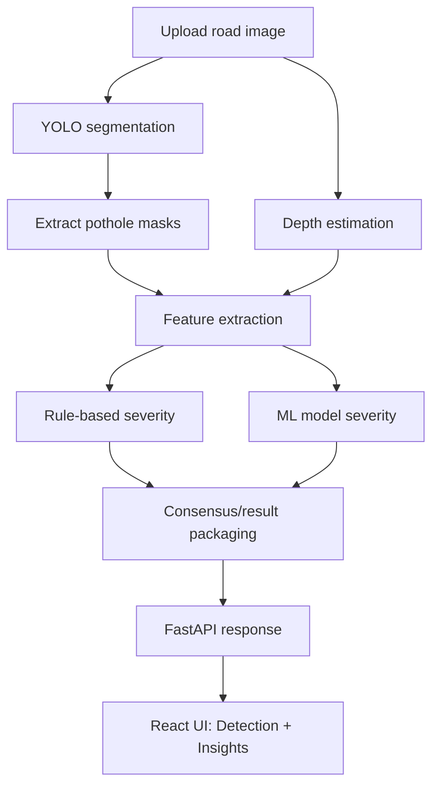

# Vision-Based Pothole Detection



[](https://www.python.org/)
[](https://fastapi.tiangolo.com/)
[](https://react.dev/)
[](https://vitejs.dev/)
[](https://docs.ultralytics.com/)

A full pothole analysis stack that combines segmentation, depth estimation, rule-based logic, and machine learning in a single workflow.

## Quick Access Links

| Resource | Link |
|---|---|
| Live Website (Frontend) | https://web-ui-sage-five.vercel.app |
| Live API (Backend) | https://atharvahonparkhe77-vision-based-pothole-detection-api.hf.space |
| RDD2022 GitHub Repository | https://github.com/sekilab/RoadDamageDetector |
| Pothole-600 Dataset Page | https://sites.google.com/view/pothole-600/dataset |
| Kaggle Pothole Segmentation Dataset | https://www.kaggle.com/datasets/farzadnekouei/pothole-image-segmentation-dataset |

> Dataset note: RDD2022 is linked from GitHub (as used in `scripts/convert_rdd2022.py`).
> Pothole-600 is linked from its official dataset page (as used in `scripts/convert_pothole600.py`).

## Table of Contents

- [1. What This Project Does](#1-what-this-project-does)
- [Quick Access Links](#quick-access-links)
- [2. Current Directory Structure](#2-current-directory-structure)
- [3. How It Works](#3-how-it-works)
- [4. First-Time Setup (Detailed)](#4-first-time-setup-detailed)
- [5. Run the Project](#5-run-the-project)
- [6. Training and Evaluation](#6-training-and-evaluation)
- [7. API Endpoints](#7-api-endpoints)
- [8. Frontend Overview](#8-frontend-overview)
- [9. Deployment Overview](#9-deployment-overview)
- [10. Troubleshooting](#10-troubleshooting)

## 1. What This Project Does

This project analyzes road images and estimates pothole severity by combining:

- YOLO-based pothole segmentation
- Depth estimation from monocular images
- Rule-based severity logic
- ML model predictions and comparison reports
- A web dashboard for detection and insights

Typical output includes:

- Pothole-level severity predictions
- Overlay visualizations
- Schematic JSON output
- Model insights from `ml_results/`

## 2. Current Directory Structure

This README now reflects the directory structure you shared as the active/current project layout.

```text
vyankateshd206-vision-based-pothole-detection/
|-- README.md
|-- api.py
|-- classifier.py
|-- Dockerfile
|-- features.py
|-- inference.py
|-- main.py
|-- ml_classifier.py
|-- PIPELINE.md
|-- report.tex
|-- requirements.txt
|-- road_segment_analysis.py
|-- segmentation.py
|-- test_pipeline.py
|-- .dockerignore
|-- .env.example
|-- depth/
|   |-- generate_depth.py
|   `-- global_normalize.py
|-- ml_models/
|   |-- feature_scaler.pkl
|   |-- logistic_regression.pkl
|   `-- naive_bayes.pkl
|-- ml_results/
|   |-- ablation_study.csv
|   |-- classification_report_ensemble.txt
|   |-- classification_report_knn.txt
|   |-- classification_report_lightgbm.txt
|   |-- classification_report_Logistic Regression.txt
|   |-- classification_report_mlp.txt
|   |-- classification_report_Naive Bayes.txt
|   |-- classification_report_Random Forest.txt
|   |-- classification_report_SVM.txt
|   `-- classification_report_xgboost.txt
|-- model_insights_1/
|   |-- code.html
|   `-- DESIGN.md
|-- scripts/
|   |-- convert_pothole600.py
|   |-- convert_rdd2022.py
|   |-- dataset_summary.py
|   |-- deduplicate.py
|   |-- extract_gps.py
|   |-- retrain_yolo.py
|   |-- verification_report.txt
|   `-- verify_dataset.py
|-- web-ui/
|   |-- README.md
|   |-- eslint.config.js
|   |-- index.html
|   |-- package.json
|   |-- vercel.json
|   |-- vite.config.js
|   |-- .env.example
|   `-- src/
|       |-- App.jsx
|       |-- index.css
|       |-- main.jsx
|       |-- mockData.js
|       `-- components/
|           |-- AccuracyChart.jsx
|           |-- ClassifierTable.jsx
|           |-- FeatureStrip.jsx
|           |-- ImagePanels.jsx
|           |-- InsightsHub.jsx
|           |-- LoadingSkeleton.jsx
|           |-- SeverityBadge.jsx
|           `-- UploadPanel.jsx
|-- yolo-segmentation/
|   |-- README.md
|   `-- road_damage_assessment_app.py
`-- .hf-space-src/
    |-- api.py
    |-- classifier.py
    |-- Dockerfile
    |-- features.py
    |-- inference.py
    |-- requirements.txt
    |-- segmentation.py
    |-- ml_models/
    |   |-- feature_scaler.pkl
    |   |-- logistic_regression.pkl
    |   `-- naive_bayes.pkl
    `-- ml_results/
        |-- ablation_study.csv
        |-- classification_report_ensemble.txt
        |-- classification_report_knn.txt
        |-- classification_report_lightgbm.txt
        |-- classification_report_Logistic Regression.txt
        |-- classification_report_mlp.txt
        |-- classification_report_Naive Bayes.txt
        |-- classification_report_Random Forest.txt
        |-- classification_report_SVM.txt
        `-- classification_report_xgboost.txt
```

## 3. How It Works



### End-to-End Flow



### Core Python Modules

- `segmentation.py`
  - Handles pothole mask extraction from images.
- `features.py`
  - Computes geometry and depth features used in classification.
- `classifier.py`
  - Applies rule-based severity logic.
- `inference.py`
  - Unifies depth estimation + feature extraction + model inference.
- `api.py`
  - Exposes HTTP endpoints used by the web app.
- `ml_classifier.py`
  - Training and evaluation pipeline for machine learning models.

## 4. First-Time Setup (Detailed)

### 4.1 Prerequisites

Install these first:

- Python 3.10 or newer
- Node.js 18 or newer
- Git
- PowerShell (recommended on Windows)

### 4.2 Backend Setup

From project root:

```powershell
python -m venv .venv
.venv\Scripts\activate
python -m pip install --upgrade pip
python -m pip install -r requirements.txt
copy .env.example .env
```

### 4.3 External Assets You Need for Local Inference

Some runtime assets are not guaranteed to be in this structure by default.

1. Depth-Anything-V2 repository

```powershell
git clone https://github.com/DepthAnything/Depth-Anything-V2.git
```

2. Depth checkpoint

Place this file at:

- `Depth-Anything-V2/checkpoints/depth_anything_v2_vits.pth`

3. YOLO segmentation weights

Create folder and place your trained model:

```powershell
mkdir yolo-segmentation\model
```

Required file:

- `yolo-segmentation/model/best.pt`

### 4.4 Frontend Setup

```powershell
cd web-ui
copy .env.example .env
npm install
```

Set frontend API URL in `web-ui/.env`:

```env
VITE_API_BASE_URL=http://localhost:8000
```

### 4.5 Backend Environment

Use `.env` in project root (created from `.env.example`). Typical values:

```env
FRONTEND_ORIGINS=http://localhost:5173,http://127.0.0.1:5173
PORT=8000
UVICORN_RELOAD=false
```

## 5. Run the Project

### 5.1 Start backend API

From project root:

```powershell
python api.py
```

Backend health check:

```powershell
Invoke-RestMethod -Uri "http://localhost:8000/healthz" -Method Get
```

### 5.2 Start frontend

From `web-ui/`:

```powershell
npm run dev
```

Open:

- Frontend: http://localhost:5173
- Backend: http://localhost:8000

### 5.3 Run CLI inference

```powershell
python inference.py <path_to_image> --output_dir output --no_show
```

### 5.4 Run original rule-only pipeline

```powershell
python main.py <path_to_image> --output_dir output --no_show
```

## 6. Training and Evaluation

<details>
<summary><strong>Expand training workflow</strong></summary>

### Step 1: Prepare dataset

Dataset is not guaranteed to be bundled in this structure. You can:

- place data in your preferred folder
- update dataset paths in training scripts accordingly

### Step 2: Generate depth maps

```powershell
python depth/generate_depth.py
```

### Step 3: Train models

```powershell
python ml_classifier.py
```

### Step 4: Validate pipeline

```powershell
python test_pipeline.py
```

### Step 5: Inspect results

- `ml_models/` for saved artifacts
- `ml_results/` for reports and study files

</details>

## 7. API Endpoints

### `GET /healthz`

Backend health endpoint.

### `POST /analyze`

- Input: image file upload (`multipart/form-data`, field name `file`)
- Output: severity decisions, per-pothole information, and visualization payload

### `GET /insights/summary`

Returns insights data consumed by `InsightsHub.jsx`.

### `GET /insights/files/{file_name}`

Serves allowed artifacts from `ml_results/`.

## 8. Frontend Overview

Key frontend entry points:

- `web-ui/src/App.jsx`
- `web-ui/src/components/UploadPanel.jsx`
- `web-ui/src/components/ImagePanels.jsx`
- `web-ui/src/components/InsightsHub.jsx`
- `web-ui/src/components/ClassifierTable.jsx`
- `web-ui/src/components/FeatureStrip.jsx`

The UI has two major experiences:

1. Detection flow (image upload and severity output)
2. Insights flow (metrics, charts, reports)

## 9. Deployment Overview

Current deployment style in this repository:

- Frontend on Vercel from `web-ui/`
- Backend on Hugging Face Spaces Docker using `.hf-space-src/` staging

Main deployment assets:

- `Dockerfile`
- `requirements.txt`
- `.dockerignore`
- `.hf-space-src/`
- `web-ui/vercel.json`

## 10. Troubleshooting

### Backend fails at startup

Check that both are present:

- `Depth-Anything-V2/checkpoints/depth_anything_v2_vits.pth`
- `yolo-segmentation/model/best.pt`

### Frontend cannot call backend

- Verify `VITE_API_BASE_URL` in `web-ui/.env`
- Verify CORS values in root `.env` (`FRONTEND_ORIGINS`)

### Hugging Face login works but cannot create/push

- Ensure token has repository write permission under your namespace

### Slow first request in cloud

- Free-tier spaces may sleep and need warm-up time

---

If you are a first-time user, start with Section 4 and Section 5, then move to Section 6 when you want to retrain or evaluate models.
